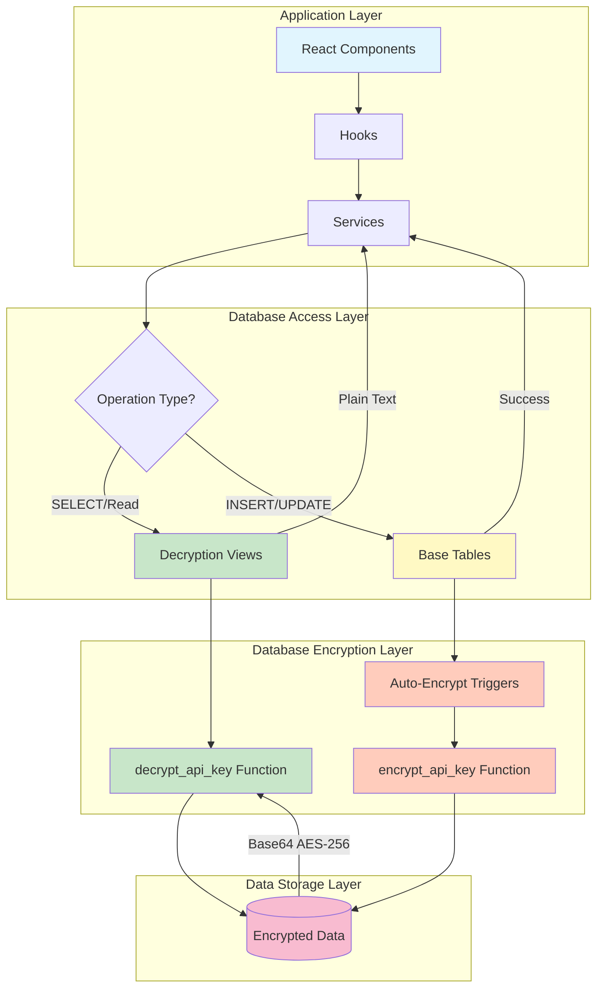
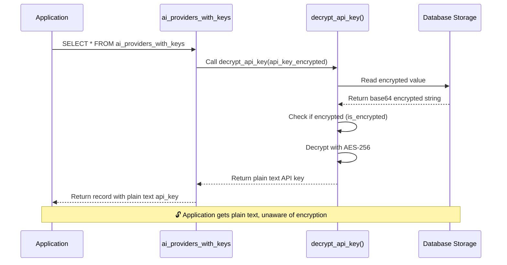
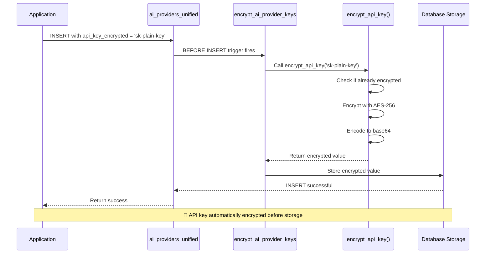

# 🔐 API Key Encryption Flow - Visual Guide

## System Architecture Diagram



## Read Flow (Decryption)



## Write Flow (Encryption)



## Complete Data Flow

```
┌─────────────────────────────────────────────────────────────┐
│                    APPLICATION LAYER                         │
│                                                              │
│  ┌──────────────┐  ┌──────────────┐  ┌──────────────┐      │
│  │   React      │  │    Hooks     │  │   Services   │      │
│  │  Components  │──│useAIProvider │──│aiProviderAdt │      │
│  └──────────────┘  └──────────────┘  └──────────────┘      │
│         │                  │                  │              │
└─────────┼──────────────────┼──────────────────┼──────────────┘
          │                  │                  │
          ▼                  ▼                  ▼
┌─────────────────────────────────────────────────────────────┐
│                   SUPABASE CLIENT LAYER                      │
│                                                              │
│          SELECT                          INSERT/UPDATE      │
│            │                                    │            │
│            ▼                                    ▼            │
│  ┌──────────────────┐              ┌──────────────────┐    │
│  │ ai_providers_    │              │ ai_providers_    │    │
│  │   with_keys      │              │   unified        │    │
│  │    (VIEW)        │              │   (TABLE)        │    │
│  └──────────────────┘              └──────────────────┘    │
│            │                                    │            │
└────────────┼────────────────────────────────────┼────────────┘
             │                                    │
             ▼                                    ▼
┌─────────────────────────────────────────────────────────────┐
│                 DATABASE FUNCTION LAYER                      │
│                                                              │
│  ┌──────────────────┐              ┌──────────────────┐    │
│  │ decrypt_api_key  │              │ TRIGGER: auto_   │    │
│  │                  │              │ encrypt_ai_      │    │
│  │ • Detect format  │              │ provider_keys    │    │
│  │ • Decode base64  │              │                  │    │
│  │ • Decrypt AES256 │              │ encrypt_api_key  │    │
│  │ • Return plain   │              │                  │    │
│  │   text           │              │ • Check if plain │    │
│  └──────────────────┘              │ • Encrypt AES256 │    │
│            │                        │ • Encode base64  │    │
│            │                        └──────────────────┘    │
│            │                                    │            │
└────────────┼────────────────────────────────────┼────────────┘
             │                                    │
             ▼                                    ▼
┌─────────────────────────────────────────────────────────────┐
│                   DATABASE STORAGE                           │
│                                                              │
│         api_key_encrypted column                            │
│         ═══════════════════════════                         │
│         Stored as: base64(AES-256(plain_key))               │
│                                                              │
│         Example:                                            │
│         "c2stdGVzdDEyMzQ1Njc4OTBhYmNkZWY="                  │
│                                                              │
└─────────────────────────────────────────────────────────────┘
```

## Component Update Flow

```
BEFORE (Direct Table Access):
┌──────────────┐
│  Component   │
│              │
│ .from('ai_   │──SELECT──┐
│  providers_  │          │
│  unified')   │          ▼
└──────────────┘   ┌─────────────┐
                   │ Database    │
                   │ (ENCRYPTED) │
                   └─────────────┘
                          │
                          ▼
                   ❌ Returns encrypted
                      base64 string
                      (NOT USABLE)


AFTER (View Access):
┌──────────────┐
│  Component   │
│              │
│ .from('ai_   │──SELECT──┐
│  providers_  │          │
│  with_keys') │          ▼
└──────────────┘   ┌─────────────┐
                   │    VIEW     │
                   │             │
                   │ decrypt_    │
                   │ api_key()   │
                   └─────────────┘
                          │
                          ▼
                   ┌─────────────┐
                   │ Database    │
                   │ (ENCRYPTED) │
                   └─────────────┘
                          │
                          ▼
                   ✅ Returns plain
                      text API key
                      (READY TO USE)
```

## Encryption Workflow

```
┌─────────────────────────────────────────────────────────────┐
│  1. Developer writes plain text API key                     │
│     const provider = {                                       │
│       api_key_encrypted: 'sk-plain-text-key-12345'          │
│     }                                                        │
└─────────────────────────────────────────────────────────────┘
                          │
                          ▼
┌─────────────────────────────────────────────────────────────┐
│  2. Application inserts to base table                       │
│     supabase.from('ai_providers_unified').insert(provider)  │
└─────────────────────────────────────────────────────────────┘
                          │
                          ▼
┌─────────────────────────────────────────────────────────────┐
│  3. BEFORE INSERT trigger fires                             │
│     encrypt_ai_provider_keys_trigger()                      │
└─────────────────────────────────────────────────────────────┘
                          │
                          ▼
┌─────────────────────────────────────────────────────────────┐
│  4. Check if already encrypted                              │
│     is_encrypted('sk-plain-text-key-12345')                 │
│     → FALSE (starts with 'sk-')                             │
└─────────────────────────────────────────────────────────────┘
                          │
                          ▼
┌─────────────────────────────────────────────────────────────┐
│  5. Encrypt with AES-256                                    │
│     encrypt(                                                │
│       'sk-plain-text-key-12345',                           │
│       'yacht-sentinel-encryption-key-2024',                │
│       'aes'                                                 │
│     )                                                       │
└─────────────────────────────────────────────────────────────┘
                          │
                          ▼
┌─────────────────────────────────────────────────────────────┐
│  6. Encode to base64                                        │
│     encode(encrypted_bytes, 'base64')                       │
│     → "c2stdGVzdDEyMzQ1Njc4OTBhYmNkZWY="                   │
└─────────────────────────────────────────────────────────────┘
                          │
                          ▼
┌─────────────────────────────────────────────────────────────┐
│  7. Store encrypted value                                   │
│     api_key_encrypted = "c2stdGVzdDEyMzQ1Njc4OTBhYmNkZWY="  │
└─────────────────────────────────────────────────────────────┘
                          │
                          ▼
┌─────────────────────────────────────────────────────────────┐
│  8. Return success to application                           │
│     ✅ INSERT successful                                     │
└─────────────────────────────────────────────────────────────┘
```

## Decryption Workflow

```
┌─────────────────────────────────────────────────────────────┐
│  1. Application reads from view                             │
│     supabase.from('ai_providers_with_keys').select('*')    │
└─────────────────────────────────────────────────────────────┘
                          │
                          ▼
┌─────────────────────────────────────────────────────────────┐
│  2. View calls decrypt function                             │
│     decrypt_api_key(api_key_encrypted)                      │
└─────────────────────────────────────────────────────────────┘
                          │
                          ▼
┌─────────────────────────────────────────────────────────────┐
│  3. Read encrypted value from database                      │
│     api_key_encrypted = "c2stdGVzdDEyMzQ1Njc4OTBhYmNkZWY="  │
└─────────────────────────────────────────────────────────────┘
                          │
                          ▼
┌─────────────────────────────────────────────────────────────┐
│  4. Check if encrypted                                      │
│     is_encrypted("c2stdGVzdDEyMzQ1Njc4OTBhYmNkZWY=")        │
│     → TRUE (base64 format)                                  │
└─────────────────────────────────────────────────────────────┘
                          │
                          ▼
┌─────────────────────────────────────────────────────────────┐
│  5. Decode from base64                                      │
│     decode("c2stdGVzdDEyMzQ1Njc4OTBhYmNkZWY=", 'base64')   │
└─────────────────────────────────────────────────────────────┘
                          │
                          ▼
┌─────────────────────────────────────────────────────────────┐
│  6. Decrypt with AES-256                                    │
│     decrypt(                                                │
│       encrypted_bytes,                                      │
│       'yacht-sentinel-encryption-key-2024',                │
│       'aes'                                                 │
│     )                                                       │
└─────────────────────────────────────────────────────────────┘
                          │
                          ▼
┌─────────────────────────────────────────────────────────────┐
│  7. Return plain text                                       │
│     → "sk-plain-text-key-12345"                            │
└─────────────────────────────────────────────────────────────┘
                          │
                          ▼
┌─────────────────────────────────────────────────────────────┐
│  8. Application receives plain text API key                │
│     data[0].api_key = "sk-plain-text-key-12345"            │
│     ✅ Ready to use for API calls                           │
└─────────────────────────────────────────────────────────────┘
```

## File Update Pattern

```
┌─────────────────────────────────────────────────────────────┐
│  OLD CODE (Before Implementation)                           │
├─────────────────────────────────────────────────────────────┤
│                                                              │
│  const { data } = await supabase                            │
│    .from('ai_providers_unified')  ← Direct table           │
│    .select('*');                                            │
│                                                              │
│  // Problem: Returns encrypted base64                       │
│  console.log(data[0].api_key_encrypted);                    │
│  // "c2stdGVzdDEyMzQ1Njc4OTBhYmNkZWY="  ← Can't use this!  │
│                                                              │
└─────────────────────────────────────────────────────────────┘
                          │
                          ▼
┌─────────────────────────────────────────────────────────────┐
│  NEW CODE (After Implementation)                            │
├─────────────────────────────────────────────────────────────┤
│                                                              │
│  const { data } = await supabase                            │
│    .from('ai_providers_with_keys')  ← Decryption view      │
│    .select('*');                                            │
│                                                              │
│  // Solution: Returns plain text                            │
│  console.log(data[0].api_key);                              │
│  // "sk-plain-text-key-12345"  ← Ready to use! ✅           │
│                                                              │
└─────────────────────────────────────────────────────────────┘
```

## Security Flow

```
┌──────────────────────────────────────────────────────────────┐
│                     SECURITY LAYERS                          │
├──────────────────────────────────────────────────────────────┤
│                                                               │
│  Layer 1: RLS (Row Level Security)                          │
│  ┌─────────────────────────────────────────────────────┐   │
│  │  • Users can only access their own providers        │   │
│  │  • Service role bypasses RLS                        │   │
│  │  • Anon role has limited access                     │   │
│  └─────────────────────────────────────────────────────┘   │
│                          │                                   │
│                          ▼                                   │
│  Layer 2: Encryption (AES-256)                              │
│  ┌─────────────────────────────────────────────────────┐   │
│  │  • All API keys encrypted at rest                   │   │
│  │  • Encryption key stored securely                   │   │
│  │  • No plain text in database                        │   │
│  └─────────────────────────────────────────────────────┘   │
│                          │                                   │
│                          ▼                                   │
│  Layer 3: View Access Control                               │
│  ┌─────────────────────────────────────────────────────┐   │
│  │  • Only authenticated users access views            │   │
│  │  • Decryption happens on authorized read            │   │
│  │  • Audit logs track access (optional)               │   │
│  └─────────────────────────────────────────────────────┘   │
│                          │                                   │
│                          ▼                                   │
│  Layer 4: Application Logic                                 │
│  ┌─────────────────────────────────────────────────────┐   │
│  │  • API keys used only for authorized requests       │   │
│  │  • Never exposed to client-side                     │   │
│  │  • Logged/monitored for security                    │   │
│  └─────────────────────────────────────────────────────┘   │
│                                                               │
└──────────────────────────────────────────────────────────────┘
```

## Tables & Views Relationship

```
BASE TABLES (Write Operations)
┌─────────────────────────────────────┐
│  ai_providers_unified                │
│  ─────────────────────────────────  │
│  id                                  │
│  name                                │
│  provider_type                       │
│  api_key_encrypted  ← ENCRYPTED      │
│  base_url                            │
│  is_active                           │
│  config                              │
│  ...                                 │
└─────────────────────────────────────┘
           │
           │ SELECT with decrypt
           ▼
VIEWS (Read Operations)
┌─────────────────────────────────────┐
│  ai_providers_with_keys              │
│  ─────────────────────────────────  │
│  id                                  │
│  name                                │
│  provider_type                       │
│  api_key  ← DECRYPTED (plain text)   │
│  api_key_encrypted  ← Still included │
│  base_url                            │
│  is_active                           │
│  config                              │
│  ...                                 │
└─────────────────────────────────────┘


BASE TABLES (Write Operations)
┌─────────────────────────────────────┐
│  document_ai_processors              │
│  ─────────────────────────────────  │
│  id                                  │
│  name                                │
│  processor_id                        │
│  gcp_credentials_encrypted ← ENCRYPT │
│  gcp_service_account_encrypted       │
│  location                            │
│  ...                                 │
└─────────────────────────────────────┘
           │
           │ SELECT with decrypt
           ▼
VIEWS (Read Operations)
┌─────────────────────────────────────┐
│  document_ai_processors_with_creds   │
│  ─────────────────────────────────  │
│  id                                  │
│  name                                │
│  processor_id                        │
│  gcp_credentials  ← DECRYPTED        │
│  gcp_service_account  ← DECRYPTED    │
│  location                            │
│  ...                                 │
└─────────────────────────────────────┘
```

## Key Takeaways

1. **📖 Read Operations**: Always use VIEWS for automatic decryption
   - `ai_providers_with_keys`
   - `document_ai_processors_with_credentials`

2. **✍️ Write Operations**: Always use BASE TABLES for automatic encryption
   - `ai_providers_unified`
   - `document_ai_processors`

3. **🔐 Security**: AES-256 encryption happens automatically via triggers

4. **🚀 Performance**: Minimal overhead (~1ms encryption, ~0.5ms decryption)

5. **🔄 Backward Compatible**: Plain text keys still work (no breaking changes)

---

**Visual Guide Complete** ✅  
All flows documented with diagrams and examples!
