# 🚀 Full Stack Startup Process Flow

## Complete Process with Integrated Backup System

This document shows the complete flow of the `start_full_stack.sh` script with the integrated comprehensive backup system.

---

## 📊 Process Flow Diagram

```mermaid
graph TB
    Start([🎯 Start Full Stack Script]) --> CheckBackup[🔍 Check for Unified Complete Backup]
    CheckBackup --> BackupFound{Backup Found?}
    BackupFound -->|Yes| UseUnified[📦 Use Unified Complete Backup]
    BackupFound -->|No| UseLegacy[📦 Fall Back to Legacy Backup]
    
    UseUnified --> StartDocker[🐳 Start Docker Desktop]
    UseLegacy --> StartDocker
    
    StartDocker --> DockerRunning{Docker Running?}
    DockerRunning -->|Yes| DockerReady[✅ Docker Already Ready]
    DockerRunning -->|No| LaunchDocker[🚀 Launch Docker Desktop App]
    
    DockerReady --> WaitDocker[⏳ Wait for Docker Daemon]
    LaunchDocker --> WaitDocker
    
    WaitDocker --> StopServices[🛑 Stop Running Services]
    StopServices --> StartSupabase[🚀 Start Supabase]
    
    StartSupabase --> CheckDB[🔍 Check Database State]
    CheckDB --> TableCount{Tables < 15?}
    
    TableCount -->|Yes| RestoreDB[📦 Restore from Backup]
    TableCount -->|No| SkipRestore[✅ DB Already Populated]
    
    RestoreDB --> VerifyEncryption[🔐 Verify Encryption System]
    SkipRestore --> VerifyEncryption
    
    VerifyEncryption --> CheckUsers[👥 Check User Data]
    CheckUsers --> UserCount{Users < 6?}
    
    UserCount -->|Yes| CreateUsers[👤 Create All 6 Users]
    UserCount -->|No| SkipUsers[✅ Users Already Exist]
    
    CreateUsers --> VerifyUsers[✅ Verify User Creation]
    SkipUsers --> VerifyUsers
    
    VerifyUsers --> StartFrontend[🌐 Start Frontend Server]
    StartFrontend --> FrontendStarted[✅ Frontend Running]
    
    FrontendStarted --> CreateBackup[💾 CREATE COMPREHENSIVE BACKUP]
    
    CreateBackup --> BackupScript{Backup Script Exists?}
    BackupScript -->|Yes| MakeExecutable[🔧 Make Script Executable]
    BackupScript -->|No| SkipBackup[⚠️ Skip Backup]
    
    MakeExecutable --> RunBackground[🚀 Run Backup in Background]
    RunBackground --> BackupStarted[✅ Backup Process Started]
    
    BackupStarted --> ShowStatus[📊 Display System Status]
    SkipBackup --> ShowStatus
    
    ShowStatus --> ShowStats[📈 Display Database Statistics]
    ShowStats --> ShowSecurity[🔐 Display Security Status]
    ShowSecurity --> ShowCredentials[🔑 Display Login Credentials]
    ShowCredentials --> Complete[🎉 Full Stack Ready!]
    
    Complete --> Wait([⏸️ Wait for Frontend Process])
```



---

## 📋 Step-by-Step Breakdown

### Phase 1: Initial Checks & Docker (Lines 1-140)

```bash
1. Display Header & Configuration
   ├── Define colors and constants
   ├── Set backup paths
   └── Configure database connection

2. Check for Unified Complete Backup
   ├── Look for: supabase_backups/unified_complete_*
   ├── If found: Use unified backup (includes everything)
   └── If not found: Fall back to legacy backup

3. Start Docker Desktop
   ├── Check if Docker is already running
   ├── If not: Launch Docker Desktop app
   ├── Wait for Docker process to start
   ├── Wait for Docker daemon to be accessible
   └── Verify Docker is ready
```

**Output Example:**
```
🎯 WITH UNIFIED COMPLETE BACKUP
✅ Found unified complete backup:
   ✓ Includes: Complete database with encryption
   ✓ Includes: All application source code
   ✓ Includes: All 23 migrations
✅ Docker Desktop is ready
```

---

### Phase 2: Services Startup (Lines 141-190)

```bash
4. Stop Any Running Services
   ├── Stop Supabase (if running)
   ├── Kill processes on port 5174
   └── Kill any Vite processes

5. Start Supabase
   ├── Run: npx supabase start
   ├── Wait 5 seconds for initialization
   └── Verify Supabase is accessible
```

**Output Example:**
```
🛑 Stopping any running services...
✅ All services stopped

🚀 Starting Supabase...
✅ Supabase started
```

---

### Phase 3: Database Restoration (Lines 191-330)

```bash
6. Check Database State
   ├── Query table count in public schema
   ├── If < 15 tables: Database needs restoration
   └── If >= 15 tables: Database already populated

7. Restore Database (if needed)
   ├── Terminate existing connections
   ├── If unified backup:
   │   ├── Use unified restore script
   │   └── Or manual restore from .dump file
   └── If legacy backup:
       └── Use pg_restore with legacy .dump file

8. Verify Database Restoration
   ├── Check final table count
   ├── Verify encryption functions (>= 3)
   ├── Check for core encryption functions
   └── Apply encryption migration if missing
```

**Output Example:**
```
🔍 Checking database state...
📊 Current table count: 5
⚠️ Database has less than 15 tables - restoring...

🎯 Restoring from UNIFIED COMPLETE backup...
   ✓ Complete database with AES-256 encryption
   ✓ Auto-encryption triggers and views
   ✓ All application source code

✅ Database restored from unified complete backup
✅ Database now has 23 tables
✅ Encryption functions verified (4 functions)
```

---

### Phase 4: User Creation System (Lines 331-450)

```bash
9. Check User Data
   ├── Count users in auth.users
   ├── Count user roles in user_roles
   └── Determine if users need creation

10. Create Users Systematically (if needed)
    ├── Function: create_user_systematic()
    │   ├── Try: Service Role API (preferred)
    │   └── Fallback: Direct SQL insertion
    │
    ├── Create 6 users:
    │   ├── superadmin@yachtexcel.com (superadmin)
    │   ├── admin@yachtexcel.com (admin)
    │   ├── manager@yachtexcel.com (manager)
    │   ├── user@yachtexcel.com (user)
    │   ├── viewer@yachtexcel.com (viewer)
    │   └── guest@yachtexcel.com (guest)
    │
    └── Assign roles automatically via triggers

11. Verify User Creation
    ├── Check final user count
    ├── Check final user roles count
    └── Display creation summary
```

**Output Example:**
```
👥 Checking user data and creating missing users...
📊 Current users: 0, roles: 0
⚠️ Missing users detected - creating all 6 users...

   👤 Creating superadmin: superadmin@yachtexcel.com
      ✅ User created - ID: a1b2c3d4...
      ✅ Role assigned
   👤 Creating admin: admin@yachtexcel.com
      ✅ User created - ID: e5f6g7h8...
      ✅ Role assigned
   ... (continues for all 6 users)

✅ User creation completed: 6/6 users created
```

---

### Phase 5: Frontend Startup (Lines 451-500)

```bash
12. Start Frontend Development Server
    ├── Run: npm run dev (in background)
    ├── Capture process ID (VITE_PID)
    ├── Wait 5 seconds for initialization
    └── Verify process is still running

13. Check Frontend Status
    ├── If running: Display success
    └── If failed: Exit with error
```

**Output Example:**
```
🌐 Starting Frontend Development Server...
   Frontend will start on http://localhost:5173

⏳ Waiting for frontend to start...
✅ Frontend started successfully
```

---

### Phase 6: 💾 COMPREHENSIVE BACKUP CREATION (Lines 550-575)

```bash
14. Create Comprehensive Backup 📦
    ├── Check if backup script exists
    │   └── ./create_comprehensive_backup.sh
    │
    ├── If exists:
    │   ├── Make script executable (chmod +x)
    │   ├── Run in BACKGROUND (non-blocking)
    │   ├── Redirect output to /tmp/comprehensive_backup.log
    │   ├── Capture background process ID
    │   └── Display confirmation
    │
    └── If not exists:
        └── Display warning and skip

15. Backup Process (Background - 11 Steps):
    Step 1: Backup ALL database tables with data
    Step 2: Backup users with encrypted passwords
    Step 3: Backup user roles with all details
    Step 4: Backup ALL RLS policies
    Step 5: Backup ALL RPC functions
    Step 6: Backup ALL migrations
    Step 7: Backup ALL Edge Functions
    Step 8: Backup encryption configuration
    Step 9: Backup ALL data records (CSV per table)
    Step 10: Create backup manifest
    Step 11: Create automated restore script

16. Backup Output:
    Creates: supabase_backups/comprehensive_backup_YYYYMMDD_HHMMSS/
    ├── complete_database_with_data.dump (binary)
    ├── complete_database_with_data.sql (readable)
    ├── users_with_encrypted_passwords.sql
    ├── user_roles_complete.sql
    ├── rls_policies_complete.sql
    ├── rpc_functions_complete.sql
    ├── encryption_system.sql
    ├── BACKUP_MANIFEST.md
    ├── restore_complete_backup.sh
    ├── migrations/ (all 24+ files)
    ├── edge_functions/ (all 73+ functions)
    └── data_records/ (CSV for each table)
```

**Output Example:**
```
💾 Creating comprehensive backup of current system state...
   (This backs up EVERYTHING: data, users, roles, functions, migrations, etc.)

✅ Comprehensive backup started in background (PID: 54321)
   Check progress: tail -f /tmp/comprehensive_backup.log
   Backup includes: Users, Roles, Policies, Functions, Migrations, Edge Functions, All Data
```

**Background Process Output (in /tmp/comprehensive_backup.log):**
```
📦 COMPREHENSIVE BACKUP - ZERO DATA LOSS GUARANTEE
📁 Backup location: supabase_backups/comprehensive_backup_20251012_143022

🗄️ Step 1: Backing up ALL database tables with data...
✅ Database backup complete (schema + all data)

👥 Step 2: Backing up users with encrypted passwords...
✅ Users backup complete (with encrypted passwords)

👔 Step 3: Backing up user roles with all details...
✅ User roles backup complete

🔐 Step 4: Backing up ALL RLS policies...
✅ RLS policies backup complete (88 policies)

⚙️ Step 5: Backing up ALL RPC functions...
✅ RPC functions backup complete (20 functions)

🔄 Step 6: Backing up ALL migrations...
✅ Migrations backup complete (24 files)

⚡ Step 7: Backing up ALL Edge Functions...
✅ Edge Functions backup complete (73 functions)

🔐 Step 8: Backing up encryption configuration...
✅ Encryption configuration backup complete (4 functions)

📊 Step 9: Backing up ALL data records...
   • user_roles: 6 records
   • ai_providers_unified: 8 records
   • yachts: 12 records
   ... (all 23 tables)
✅ Data records backup complete (74 total records from 23 tables)

📋 Step 10: Creating backup manifest...
✅ Backup manifest created

🔄 Step 11: Creating automated restore script...
✅ Restore script created

✅ COMPREHENSIVE BACKUP COMPLETE
📊 Backup Summary:
   ✅ Database tables: 23 tables
   ✅ Data records: 74 total records
   ✅ Users: 6 users (with encrypted passwords)
   ✅ User roles: 6 role assignments
   ✅ RLS policies: 88 policies
   ✅ RPC functions: 20 functions
   ✅ Migrations: 24 files
   ✅ Edge Functions: 73 functions
   ✅ Encryption functions: 4 functions
```

---

### Phase 7: Status Display & Completion (Lines 576-584)

```bash
17. Display System Status
    ├── Docker version
    ├── Supabase URL (http://127.0.0.1:54321)
    ├── Database connection (localhost:54322)
    └── Frontend URL (http://localhost:5173)

18. Gather & Display Database Statistics
    ├── Count: Tables, Users, User Roles
    ├── Count: RLS Policies, RPC Functions
    ├── Count: Migrations, Edge Functions, Data Records
    └── List: Key tables and edge function names

19. Display Security & System Status
    ├── Encryption function count
    ├── AES-256 implementation status
    └── Encryption features list

20. Display Login Credentials
    └── Email: superadmin@yachtexcel.com
        Password: superadmin123

21. Display Backup Features (if unified backup)
    ├── Complete database with encryption
    ├── Application source code
    ├── Migration history
    └── Documentation and configurations

22. Display Helpful Commands
    ├── Stop services: ./stop_full_stack.sh
    ├── Manual backup: ./create_comprehensive_backup.sh
    └── Verify system: ./verify_user_creation_system.sh

23. Keep Script Running
    └── wait $VITE_PID (keeps frontend alive)
```

**Output Example:**
```
✅ FULL DEVELOPMENT STACK RUNNING
🎯 FROM UNIFIED COMPLETE BACKUP

📊 System Status:
   ✅ Docker:    27.0.3
   ✅ Supabase:  http://127.0.0.1:54321
   ✅ Database:  localhost:54322
   ✅ Frontend:  http://localhost:5173

🗄️ Database Statistics:
   ✅ Database Tables: 23 tables loaded
      → Key Tables: ai_providers_unified, inventory_items, system_settings, user_roles, yachts
   ✅ Data Records:    74 total records
   ✅ Users:           6 users
   ✅ User Roles:      6 role assignments
   ✅ RLS Policies:    88 policies
   ✅ RPC Functions:   20 functions
   ✅ Migrations:      24 applied
   ✅ Edge Functions:  73 functions
      → Functions: check-api-key, process-charter, validate-user... (+70 more)

🔐 Security & System Status:
   ✅ Encryption:      AES-256 implementation active
   ✅ Functions:       4 encryption functions

🔑 Login Credentials:
   Email:    superadmin@yachtexcel.com
   Password: superadmin123

💾 Creating comprehensive backup of current system state...
✅ Comprehensive backup started in background (PID: 54321)
   Check progress: tail -f /tmp/comprehensive_backup.log

📝 To stop all services, run: ./stop_full_stack.sh
📦 To create manual backup, run: ./create_comprehensive_backup.sh
🔍 To verify user system health, run: ./verify_user_creation_system.sh

🎉 Ready to develop!
```

---

## 🎯 Key Integration Points

### Why Backup Runs at the End:

1. **✅ Complete System State**: All services are running and verified
2. **✅ All Data Present**: Users, roles, and tables are populated
3. **✅ Verified Working**: System is confirmed operational
4. **✅ Non-Blocking**: Background execution doesn't delay development
5. **✅ Fresh Snapshot**: Captures the complete working state

### Benefits of Background Execution:

```bash
# Runs in background with output redirect
./create_comprehensive_backup.sh > /tmp/comprehensive_backup.log 2>&1 &

# Advantages:
✅ Startup completes immediately (doesn't wait for backup)
✅ You can start developing right away
✅ Backup completes in parallel (2-5 minutes typically)
✅ Progress visible via: tail -f /tmp/comprehensive_backup.log
✅ Process ID captured for monitoring
```

---

## 📊 Process Timing

Typical execution times for each phase:

```
Phase 1: Initial Checks & Docker     → 10-30 seconds
Phase 2: Services Startup            → 10-20 seconds  
Phase 3: Database Restoration        → 5-15 seconds (if needed)
Phase 4: User Creation System        → 5-10 seconds (if needed)
Phase 5: Frontend Startup            → 10-15 seconds
Phase 6: Backup Creation (BG)        → 2-5 minutes (background)
Phase 7: Status Display              → 2-3 seconds

Total Startup Time: 45-95 seconds (backup runs in parallel)
```

---

## 🔄 Process Flow Summary

```
START
  ↓
Check Backups → Start Docker → Start Supabase
  ↓
Restore DB (if needed) → Create Users (if needed)
  ↓
Start Frontend → CREATE COMPREHENSIVE BACKUP (background)
  ↓
Display Status → Ready to Develop!
  ↓
(Backup completes in background within 2-5 minutes)
```

---

## ✅ Integration Verification

### How to Verify Integration:

```bash
# 1. Check backup integration in startup script
grep -A 15 "COMPREHENSIVE BACKUP CREATION" start_full_stack.sh

# 2. Verify backup script exists and is executable
ls -la create_comprehensive_backup.sh

# 3. Start the full stack
./start_full_stack.sh

# 4. Watch for backup confirmation
# Should see: "✅ Comprehensive backup started in background"

# 5. Monitor backup progress
tail -f /tmp/comprehensive_backup.log

# 6. Verify backup completed
ls -lt supabase_backups/comprehensive_backup_* | head -1
```

---

## 🎉 Success Indicators

You know the integration is working when you see:

```
✅ FULL DEVELOPMENT STACK RUNNING
💾 Creating comprehensive backup of current system state...
✅ Comprehensive backup started in background (PID: 54321)
   Check progress: tail -f /tmp/comprehensive_backup.log
   Backup includes: Users, Roles, Policies, Functions, Migrations, Edge Functions, All Data
```

And in `/tmp/comprehensive_backup.log` (after 2-5 minutes):

```
✅ COMPREHENSIVE BACKUP COMPLETE
📊 Backup Summary:
   ✅ Database tables: 23 tables
   ✅ Data records: 74 total records
   ✅ Users: 6 users (with encrypted passwords)
   ... (complete summary)
```

---

## 📚 Related Documentation

- [`start_full_stack.sh`](./start_full_stack.sh) - Main startup script
- [`create_comprehensive_backup.sh`](./create_comprehensive_backup.sh) - Backup script
- [`BACKUP_INTEGRATION_GUIDE.md`](./BACKUP_INTEGRATION_GUIDE.md) - Integration guide
- [`COMPREHENSIVE_BACKUP_SYSTEM.md`](./COMPREHENSIVE_BACKUP_SYSTEM.md) - Complete backup docs

---

*Last Updated: October 12, 2024*
*Status: Production Ready*
*Integration: Verified and Operational*
